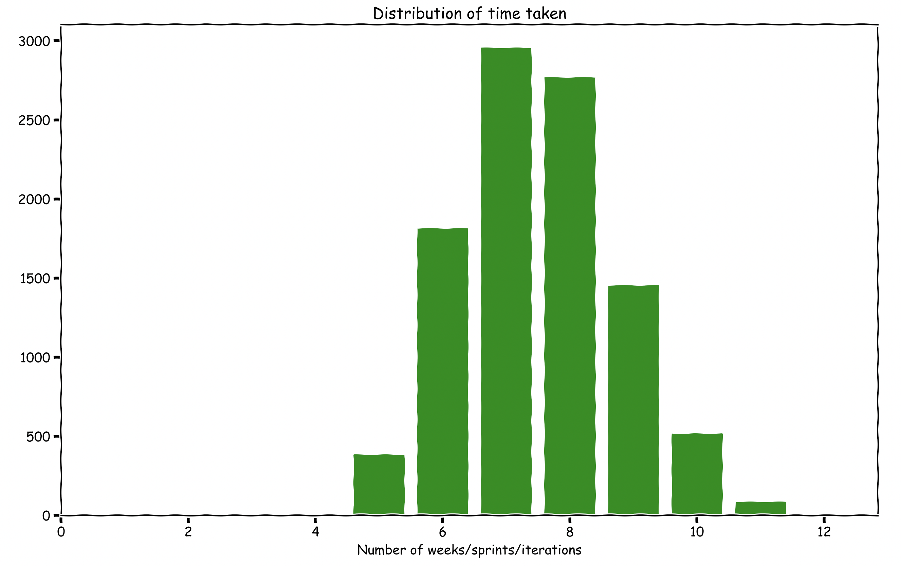
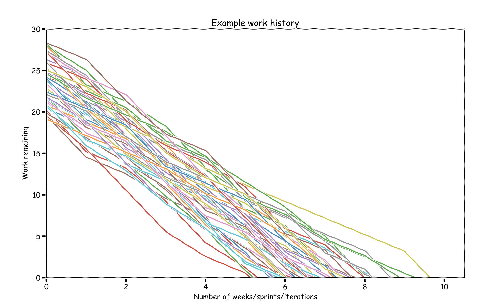

# Monte carlo simulation for forecasting deadlines

## Running
You'll need python 3.7 and pipenv then run:

```bash
pipenv install
pipenv run python predict.py
```

## Example output

Script predicts how long an estimated 19 points of work would take for a team to do:



The script considers the following "burn down" charts:

